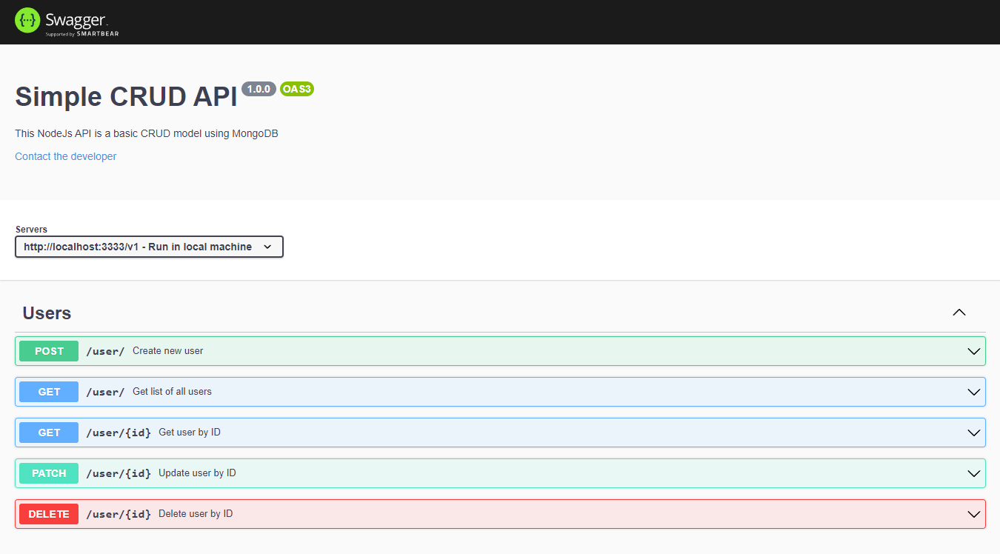

# Simple API CRUD with NodeJs and MongoDB

## In order to run this project, follow the steps below:

1. Clone this repository to your local machine:

`$ git clone https://github.com/Lu-Clemente/SimpleCrudApi`

2. In the terminal, navigate to this repository's folder:

`$ cd SimpleCrudApi`

3. Install the project:

`$ npm install` or `$ yarn install`

4. Run the project:

`$ npm start` or `$ yarn start`

## Project's Documentation on Swagger:

1. Run the server locally as instructed above.
2. In your browser, go to "http://localhost:3333/v1/apiDocs"

## Preview

 

 

